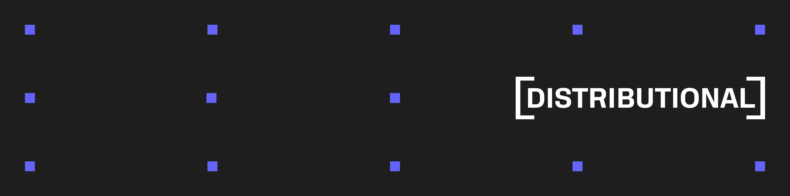

# Examples

This repository contains examples that demonstrate specific usage of the Distributional Analytics Platform, DBNL. For more information on usage of the product see https://docs.dbnl.com.

All of these examples can be previewed in our [read-only SaaS environment](https://docs.dbnl.com/get-started/quickstart#explore-the-product-with-a-read-only-saas-account).

## Prerequisites

These examples rely on a local [Sandbox deployment](https://docs.dbnl.com/platform/deployment/sandbox) of DBNL, which requires:
- Docker
- `dbnl` - (`pip install dbnl`)
- 8GB of free RAM
- 5GB of free storage

All DBNL projects require a [Model Connection](https://docs.dbnl.com/configuration/model-connections) to an LLM. For these examples [we recommend](https://docs.dbnl.com/configuration/model-connections#recommended-model-connections) GPT-OSS-20B or similar.

## List of Examples

### Quick Start

The fastest way to install a local deployment of the DBNL Sandbox and push data to your first project.

- [quickstart](quickstart/README.md): This example replicates the [local sandbox example](https://docs.dbnl.com/get-started/quickstart#deploy-a-local-sandbox-with-example-data) for spinning up a local instance of DBNL and uploading data via the Python SDK from the Quickstart in the docs: https://docs.dbnl.com/get-started/quickstart

### Getting Data into DBNL

Various examples on how to format and get data into your DBNL deployment. For first time users, we recommend [adk_calculator_sdk_from_otel](adk_calculator_sdk_from_otel/README.md) because it gives you the most control, visibility, and flexibility for the least ammount of work. For long term usage we recommend [adk_calculator_otel_direct](adk_calculator_otel_direct/README.md) because it requires the fewest external processes and storage. If you already have a mature ETL pipeline without OTEL, but have the ability to construct span data then check out [adk_calculator_sdk_from_json](adk_calculator_sdk_from_json/README.md) to see how to manually construct JSON and a pandas dataframe that fits the [DBNL Semantic Convention](https://docs.dbnl.com/configuration/dbnl-semantic-convention).

- [adk_calculator_sdk_from_json](adk_calculator_sdk_from_json/README.md): This example shows how to instrument the collection of data required by the [DBNL Semantic Convention](https://docs.dbnl.com/configuration/dbnl-semantic-convention) automatically from a simple calculator agent using the [Google ADK](https://google.github.io/adk-docs/) into JSON format, which can then be easily augmented and uploaded to DBNL via the Python SDK.
- [adk_calculator_sdk_from_otel](adk_calculator_sdk_from_otel/README.md): This example shows how to instrument the collection of data required by the [DBNL Semantic Convention](https://docs.dbnl.com/configuration/dbnl-semantic-convention) automatically from a simple calculator agent using the [Google ADK](https://google.github.io/adk-docs/) through a local OTEL collector writing raw spans to file in the [Open Inference](https://github.com/Arize-ai/openinference) semantic convention, which can then be easily augmented and uploaded to DBNL via the Python SDK. DBNL will automatically flatten traces in this format contained in the `traces_data` column in a pandas dataframe upon upload.
- [adk_calculator_otel_direct](adk_calculator_otel_direct/README.md): This example shows how to instrument a simple calculator agent using the [Google ADK](https://google.github.io/adk-docs/) to send OTEL traces directly to your DBNL deployment using the built in trace collector.
- [sdk_from_langfuse_export](sdk_from_langfuse_export/README.md): This examples shows how to transform langfuse exported traces and observation jsonl files into the [DBNL Semantic Convention](https://docs.dbnl.com/configuration/dbnl-semantic-convention), augment the resulting dataframe, and upload it to DBNL.

### Tutorials

These tutorials show completely reproduceable, end-to-end examples of using DBNL for various tasks, from simple analytics to AB testing and hyperparameter optimization.

- [adk_calculator_tutorial](adk_calculator_tutorial/README.md): This examples simulated two full weeks of data of the calculator agent above with the full [DBNL Semantic Convention](https://docs.dbnl.com/configuration/dbnl-semantic-convention).
- [ab_test_example](ab_test_example/README.md): This example shows how DBNL behavioral analytics can help discover issues and resolve them through AB testing agents.
- [nemo_agent_toolkit_hpo_example](nemo_agent_toolkit_hpo_example/README.md): This example demonstrates using NVIDIA's NeMo Agent Toolkit (NAT) for hyperparameter optimization (HPO) on a calculator agent, with DBNL providing behavioral analytics to discover issues in production.

### Walkthroughs

For more inspiration, check out [the walkthroughs in our docs](https://docs.dbnl.com/examples/walkthroughs) for more detailed and realistic examples on production agents.
