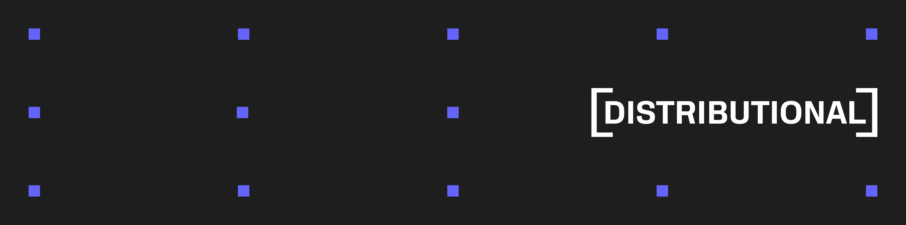

# Examples

This repository contains examples that demonstrate specific usage of the Distributional Analytics Platform, DBNL. For more information on usage of the product see https://docs.dbnl.com.

## List of Examples

- [quickstart](quickstart/README.md): This example replicates the [local sandbox example](https://docs.dbnl.com/get-started/quickstart#deploy-a-local-sandbox-with-example-data) for spinning up a local instance of DBNL and uploading data via the Python SDK
- [adk_calculator_sdk_from_json](adk_calculator_sdk_from_json/README.md): This example shows how to instrument the collection of data required by the [DBNL Semantic Convention](https://docs.dbnl.com/configuration/dbnl-semantic-convention) automatically from a simple calculator agent using the [Google ADK](https://google.github.io/adk-docs/) into JSON format, which can then be easily augmented and uploaded to DBNL via the Python SDK.
- [adk_calculator_sdk_from_otel](adk_calculator_sdk_from_otel/README.md): This example shows how to instrument the collection of data required by the [DBNL Semantic Convention](https://docs.dbnl.com/configuration/dbnl-semantic-convention) automatically from a simple calculator agent using the [Google ADK](https://google.github.io/adk-docs/) through a local OTEL collector writing raw spans to file in the [Open Inference](https://github.com/Arize-ai/openinference) semantic convention, which can then be easily augmented and uploaded to DBNL via the Python SDK. DBNL will automatically flatten traces in this format contained in the `traces_data` column in a pandas dataframe upon upload.
- [adk_calculator_otel_direct](adk_calculator_otel_direct/README.md): This example shows how to instrument a simple calculator agent using the [Google ADK](https://google.github.io/adk-docs/) to send OTEL traces directly to your DBNL deployment using the built in trace collector.
- [sdk_from_langfuse_export](sdk_from_langfuse_export/README.md): This examples shows how to transform langfuse exported traces and observation jsonl files into the [DBNL Semantic Convention](https://docs.dbnl.com/configuration/dbnl-semantic-convention), augment the resulting dataframe, and upload it to DBNL.
