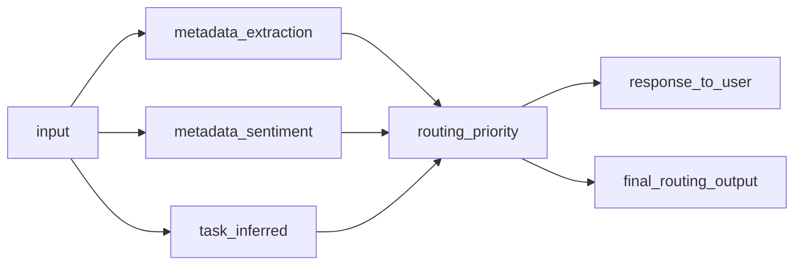

---
jupyter:
  jupytext:
    formats: ipynb,md
    text_representation:
      extension: .md
      format_name: markdown
      format_version: '1.3'
      jupytext_version: 1.16.7
  kernelspec:
    display_name: .venv
    language: python
    name: python3
---

```python
from auxiliaries import *
```

# Distributional AI Testing Demo

#### The following is the notebook associated with the customer support demo, video available [here](https://www.youtube.com/watch?v=F2e9_UxyrVs)

### Multi-Component Customer Support Routing Model



### Example of a Final Routing Output


```python
print(example_structured_output)
```

    {
      "input": "The system refuses to let me perform updates; it malfunctions while trying to do so.",
      "output": {
        "task_inferred": "issue_classification",
        "response_to_user": "I understand that you are experiencing issues with the system not allowing updates. This could be a technical problem. Please try restarting the system and see if that resolves the issue. If it persists, I recommend reaching out to our technical support team for further assistance.",
        "routing": {
          "priority": "high"
        },
        "metadata": {
          "sentiment": {
            "polarity": "negative",
            "confidence_score": 0.9
          }
        }
      }
    }


### Example Raw Tabular Data


```python
# Convert to HTML and display
import pandas as pd

data = pd.read_parquet("data.parquet")[:20]
display(HTML(data.head(2).to_html()))
```


<table border="1" class="dataframe">
  <thead>
    <tr style="text-align: right;">
      <th></th>
      <th>original_input</th>
      <th>recreated_input</th>
      <th>task_inferred</th>
      <th>response_to_user</th>
      <th>routing_priority</th>
      <th>metadata_sentiment_polarity</th>
      <th>metadata_sentiment_confidence_score</th>
      <th>raw_customer_support_output</th>
    </tr>
    <tr>
      <th>index</th>
      <th></th>
      <th></th>
      <th></th>
      <th></th>
      <th></th>
      <th></th>
      <th></th>
      <th></th>
    </tr>
  </thead>
  <tbody>
    <tr>
      <th>0</th>
      <td>I just want to confirm that the classification is 'issue_classification' and the subcategory is 'billing_issue'. There is some sort of issue behind the scenes that I cannot identify.</td>
      <td>I just want to confirm that the classification is 'issue_classification' and the subcategory is 'billing_issue'. There is some sort of issue behind the scenes that I cannot identify.</td>
      <td>issue_classification</td>
      <td>Thank you for your message. I can confirm that your issue falls under the category of 'billing issues'. Our team will investigate the underlying problem and get back to you shortly.</td>
      <td>normal</td>
      <td>neutral</td>
      <td>0.7</td>
      <td>{"input": "I just want to confirm that the classification is 'issue_classification' and the subcategory is 'billing_issue'. There is some sort of issue behind the scenes that I cannot identify.", "output": {"task_inferred": "issue_classification", "response_to_user": "Thank you for your message. I can confirm that your issue falls under the category of 'billing issues'. Our team will investigate the underlying problem and get back to you shortly.", "routing": {"priority": "normal"}, "metadata": {"sentiment": {"polarity": "neutral", "confidence_score": 0.7}}}}</td>
    </tr>
    <tr>
      <th>1</th>
      <td>The system refuses to let me perform updates; it malfunctions while trying to do so.</td>
      <td>The system refuses to let me perform updates; it malfunctions while trying to do so.</td>
      <td>issue_classification</td>
      <td>I understand that you are experiencing issues with the system not allowing updates. This could be a technical problem. Please try restarting the system and see if that resolves the issue. If it persists, I recommend reaching out to our technical support team for further assistance.</td>
      <td>high</td>
      <td>negative</td>
      <td>0.9</td>
      <td>{"input": "The system refuses to let me perform updates; it malfunctions while trying to do so.", "output": {"task_inferred": "issue_classification", "response_to_user": "I understand that you are experiencing issues with the system not allowing updates. This could be a technical problem. Please try restarting the system and see if that resolves the issue. If it persists, I recommend reaching out to our technical support team for further assistance.", "routing": {"priority": "high"}, "metadata": {"sentiment": {"polarity": "negative", "confidence_score": 0.9}}}}</td>
    </tr>
  </tbody>
</table>


### Example Augmented Tabular Data


```python
display(HTML(augmented_data.head(2).to_html()))
```


<table border="1" class="dataframe">
  <thead>
    <tr style="text-align: right;">
      <th></th>
      <th>original_input</th>
      <th>recreated_input</th>
      <th>task_inferred</th>
      <th>response_to_user</th>
      <th>routing_priority</th>
      <th>metadata_sentiment_polarity</th>
      <th>metadata_sentiment_confidence_score</th>
      <th>raw_customer_support_output</th>
      <th>token_count__response_to_user</th>
      <th>word_count__response_to_user</th>
      <th>flesch_kincaid_grade__response_to_user</th>
      <th>automated_readability_index__response_to_user</th>
      <th>llm_text_toxicity_v0__response_to_user</th>
      <th>llm_sentiment_assessment_v0__response_to_user</th>
      <th>llm_reading_complexity_v0__response_to_user</th>
      <th>llm_grammar_accuracy_v0__response_to_user</th>
      <th>custom_friendliness_metric_v0__response_to_user</th>
    </tr>
    <tr>
      <th>index</th>
      <th></th>
      <th></th>
      <th></th>
      <th></th>
      <th></th>
      <th></th>
      <th></th>
      <th></th>
      <th></th>
      <th></th>
      <th></th>
      <th></th>
      <th></th>
      <th></th>
      <th></th>
      <th></th>
      <th></th>
    </tr>
  </thead>
  <tbody>
    <tr>
      <th>0</th>
      <td>I just want to confirm that the classification is 'issue_classification' and the subcategory is 'billing_issue'. There is some sort of issue behind the scenes that I cannot identify.</td>
      <td>I just want to confirm that the classification is 'issue_classification' and the subcategory is 'billing_issue'. There is some sort of issue behind the scenes that I cannot identify.</td>
      <td>issue_classification</td>
      <td>Thank you for your message. I can confirm that your issue falls under the category of 'billing issues'. Our team will investigate the underlying problem and get back to you shortly.</td>
      <td>normal</td>
      <td>neutral</td>
      <td>0.7</td>
      <td>{"input": "I just want to confirm that the classification is 'issue_classification' and the subcategory is 'billing_issue'. There is some sort of issue behind the scenes that I cannot identify.", "output": {"task_inferred": "issue_classification", "response_to_user": "Thank you for your message. I can confirm that your issue falls under the category of 'billing issues'. Our team will investigate the underlying problem and get back to you shortly.", "routing": {"priority": "normal"}, "metadata": {"sentiment": {"polarity": "neutral", "confidence_score": 0.7}}}}</td>
      <td>36</td>
      <td>31</td>
      <td>7.3</td>
      <td>6.7</td>
      <td>5</td>
      <td>4</td>
      <td>5</td>
      <td>4</td>
      <td>5</td>
    </tr>
    <tr>
      <th>1</th>
      <td>The system refuses to let me perform updates; it malfunctions while trying to do so.</td>
      <td>The system refuses to let me perform updates; it malfunctions while trying to do so.</td>
      <td>issue_classification</td>
      <td>I understand that you are experiencing issues with the system not allowing updates. This could be a technical problem. Please try restarting the system and see if that resolves the issue. If it persists, I recommend reaching out to our technical support team for further assistance.</td>
      <td>high</td>
      <td>negative</td>
      <td>0.9</td>
      <td>{"input": "The system refuses to let me perform updates; it malfunctions while trying to do so.", "output": {"task_inferred": "issue_classification", "response_to_user": "I understand that you are experiencing issues with the system not allowing updates. This could be a technical problem. Please try restarting the system and see if that resolves the issue. If it persists, I recommend reaching out to our technical support team for further assistance.", "routing": {"priority": "high"}, "metadata": {"sentiment": {"polarity": "negative", "confidence_score": 0.9}}}}</td>
      <td>51</td>
      <td>46</td>
      <td>9.0</td>
      <td>8.6</td>
      <td>5</td>
      <td>4</td>
      <td>4</td>
      <td>5</td>
      <td>5</td>
    </tr>
  </tbody>
</table>


## Schedule Daily Augmentation & Tests


```python
from airflow import DAG
from airflow.operators.python import PythonOperator
from datetime import datetime

# Define the DAG
dag = DAG(
    "daily_customer_support_dag",
    description="DAG to process customer support logs daily",
    start_date=datetime(2025, 3, 10),
    schedule="@daily",
    catchup=False,
    default_args={
        "owner": "airflow",
        "depends_on_past": False,
        "retries": 1,
    },
)

# Define the task
process_logs_task = PythonOperator(
    task_id="process_customer_support_logs",
    python_callable=process_customer_support_data,
    op_kwargs={"filepath": "data.parquet"},
    dag=dag,
)

# Task execution
process_logs_task
```


    <Task(PythonOperator): process_customer_support_logs>
