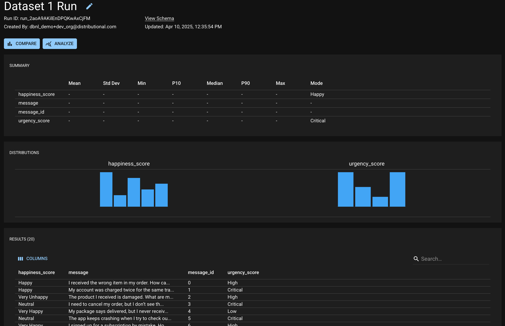

---
jupyter:
  jupytext:
    formats: ipynb,md
    text_representation:
      extension: .md
      format_name: markdown
      format_version: '1.3'
      jupytext_version: 1.16.7
  kernelspec:
    display_name: .venv
    language: python
    name: python3
---

```python
from datetime import datetime

import dbnl
import pandas as pd

COLUMN_TYPES = {0: str, 'happiness_score': 'category', 'urgency_score': 'category'}

# Load sample datasets
dataset_1 = pd.read_csv('data/dataset_1.csv', index_col=0, dtype=COLUMN_TYPES)
dataset_2 = pd.read_csv('data/dataset_2.csv', index_col=0, dtype=COLUMN_TYPES)
```


```python
# Login to dbnl
dbnl.login()
```

```python
# Create or get a project
now = datetime.now().isoformat()
project = dbnl.get_or_create_project(name=f"hello-world-demo-{now}")
```

```python
# Submit run, set it as baseline, then submit another run, and start a test session
run = dbnl.report_run_with_results(project=project, display_name="Dataset 1 Run", column_data=dataset_1.reset_index())
dbnl.set_run_as_baseline(run=run)
run = dbnl.report_run_with_results(project=project, display_name="Dataset 2 Run", column_data=dataset_2.reset_index())
```

```python
# Load sample datasets
dataset_1 = pd.read_csv('data/dataset_1.csv', index_col=0, dtype=COLUMN_TYPES)
dataset_2 = pd.read_csv('data/dataset_2.csv', index_col=0, dtype=COLUMN_TYPES)
```

```python
# Login to dbnl
dbnl.login()
```

```python
# Create or get a project
now = datetime.now().isoformat()
project = dbnl.get_or_create_project(name=f"hello-world-demo-{now}")
```

```python
# Submit run
run = dbnl.report_run_with_results(project=project, display_name="Dataset 1 Run", column_data=dataset_1.reset_index())
```

```python
# Set it as baseline
dbnl.set_run_as_baseline(run=run)
```

```python
# Submit another run, and start a test session
run = dbnl.report_run_with_results_and_start_test_session(project=project, display_name="Dataset 2 Run", column_data=dataset_2.reset_index())
```

## Verify your project is on the website, which will complete the quickstart.
Click on one of the run urls displayed above to see the created run in `dbnl`

# 

